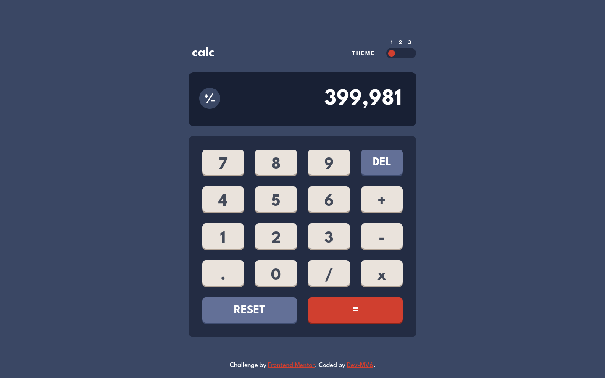

<h1 align="center">Frontend Mentor - Calculator app solution</h1>

  <h3>
    <a href="https://dev-mv6.github.io/Frontend-Mentor-Challenges/Calculator%20app/">
      Live
    </a>
     | 
    <a href="https://www.frontendmentor.io/challenges/calculator-app-9lteq5N29">
      Challenge
    </a>
    | 
    <a href="https://www.frontendmentor.io/solutions/calculator-app-N6Y57auiYc">
      Solution
    </a>
  </h3>

## Table of contents

- [Overview](#overview)
  - [The challenge](#the-challenge)
  - [Screenshots](#screenshots)
  - [Links](#links)
- [Development](#development)
  - [Built with](#built-with)
  - [Notes](#notes)
- [Author](#author)

## Overview

This is a solution to the [Calculator app challenge on Frontend Mentor](https://www.frontendmentor.io/challenges/calculator-app-9lteq5N29).

### The challenge

Users should be able to:

- See the size of the elements adjust based on their device's screen size
- Perform mathematical operations like addition, subtraction, multiplication, and division
- Adjust the color theme based on their preference
- **Bonus**: Have their initial theme preference checked using `prefers-color-scheme` and have any additional changes saved in the browser

### Screenshots

### Links

- Solution URL: [Frontend Mentor Solution](https://www.frontendmentor.io/solutions/calculator-app-N6Y57auiYc)
- Live Site URL: [GitHub Pages](https://dev-mv6.github.io/Frontend-Mentor-Challenges/Calculator%20app/)

## Development

### Built with

### Notes

My intention with this challenge was to mimic the implementation and behavior of the iOS calculator app while remaining as loyal as possible to the challenge's original design.

**Testing calculator**

Throughout development, I wrote tests for the application using [Jest](https://jestjs.io/) and [React Testing Library](https://testing-library.com/docs/react-testing-library/intro/) to ensure the calculator could perform arithmetic operations with precision.

## Author

- GitHub - [@Dev-MV6](https://github.com/Dev-MV6)
- Frontend Mentor - [@Dev-MV6](https://www.frontendmentor.io/profile/Dev-MV6)
