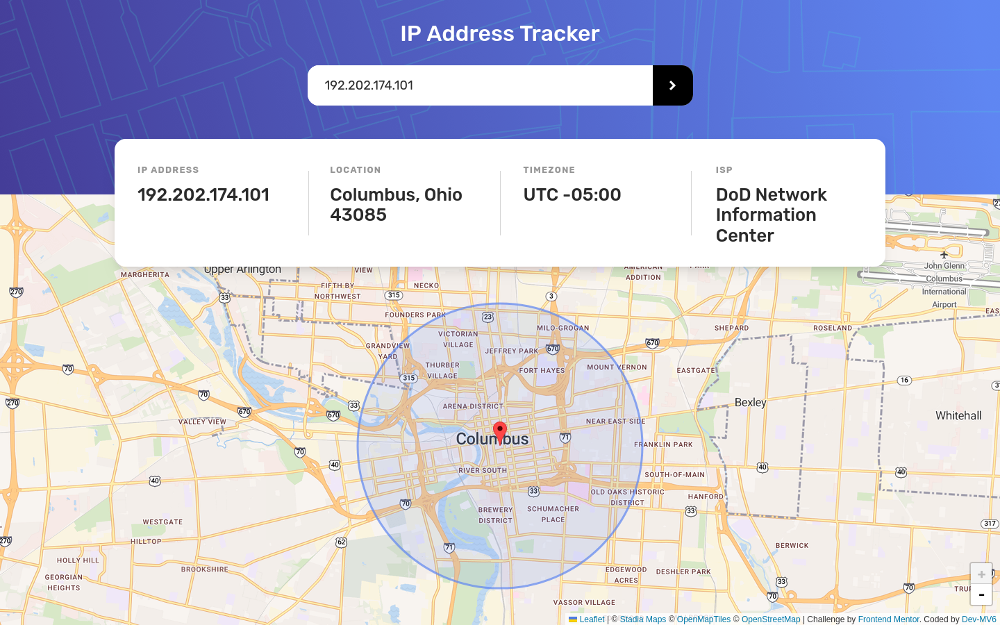

<h1 align="center">Frontend Mentor - IP address tracker solution</h1>

  <h3>
    <a href="https://dev-mv6.github.io/Frontend-Mentor-Challenges/IP%20address%20tracker/">
      Live
    </a>
     | 
    <a href="https://www.frontendmentor.io/challenges/ip-address-tracker-I8-0yYAH0">
      Challenge
    </a>
    | 
    <a href="https://www.frontendmentor.io/solutions/ip-address-tracker-3xH-UjwSPn">
      Solution
    </a>
  </h3>

## Table of contents

- [Overview](#overview)
  - [The challenge](#the-challenge)
  - [Screenshot](#screenshot)
  - [Links](#links)
- [Development](#development)
  - [Built with](#built-with)
  - [Useful resources](#useful-resources)
- [Author](#author)

## Overview

This is a solution to the [IP address tracker challenge on Frontend Mentor](https://www.frontendmentor.io/challenges/ip-address-tracker-I8-0yYAH0).

### The challenge

Users should be able to:

- View the optimal layout for each page depending on their device's screen size
- See hover states for all interactive elements on the page
- See their own IP address on the map on the initial page load
- Search for any IP addresses or domains and see the key information and location

### Screenshot

### Links

- Solution URL: [Frontend Mentor Solution](https://www.frontendmentor.io/solutions/ip-address-tracker-3xH-UjwSPn)
- Live Site URL: [GitHub Pages](https://dev-mv6.github.io/Frontend-Mentor-Challenges/IP%20address%20tracker/)

## Development

### Built with

### Useful resources

- [IPify Geolocation API](https://geo.ipify.org/)
- [Leaflet](https://leafletjs.com/)
- [Stadia Maps Tiling service](https://docs.stadiamaps.com/map-styles/osm-bright/)

## Author

- GitHub - [@Dev-MV6](https://github.com/Dev-MV6)
- Frontend Mentor - [@Dev-MV6](https://www.frontendmentor.io/profile/Dev-MV6)
