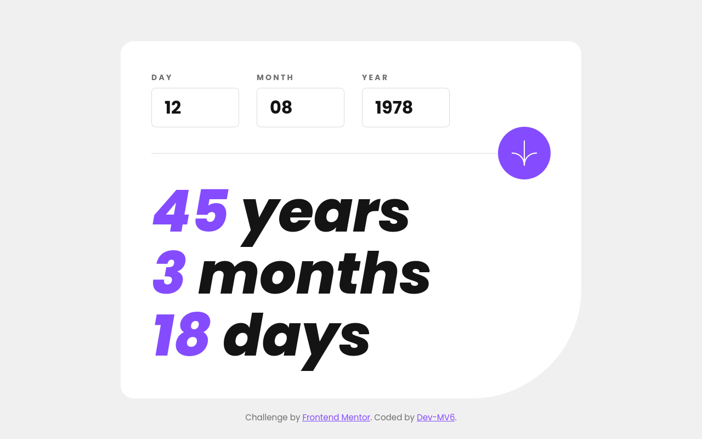
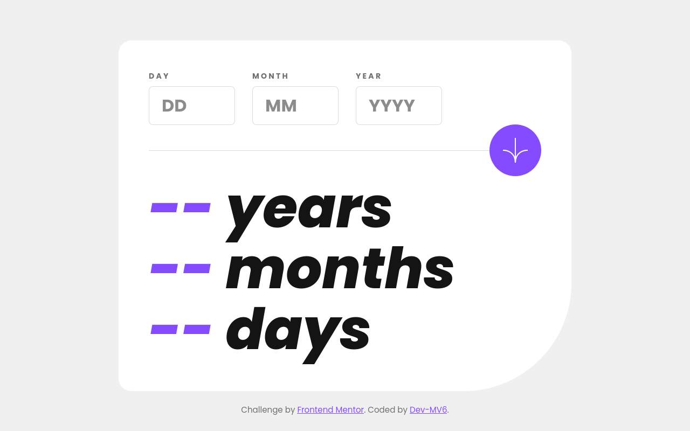

<h1 align="center">Frontend Mentor - Age calculator app solution</h1>

  <h3>
    <a href="https://dev-mv6.github.io/Frontend-Mentor-Challenges/J-Challenges/Age%20calculator%20app/">
      Live
    </a>
     | 
    <a href="https://www.frontendmentor.io/challenges/age-calculator-app-dF9DFFpj-Q">
      Challenge
    </a>
    | 
    <a href="https://www.frontendmentor.io/solutions/age-calculator-app-bNwuUuBJ8D">
      Solution
    </a>
  </h3>

## Table of contents

- [Overview](#overview)
  - [The challenge](#the-challenge)
  - [Screenshot](#screenshot)
  - [Links](#links)
- [Development](#development)
  - [Built with](#built-with)
- [Author](#author)

## Overview

This is a solution to the [Age calculator app challenge on Frontend Mentor](https://www.frontendmentor.io/challenges/age-calculator-app-dF9DFFpj-Q).

### The challenge

Users should be able to:

- View an age in years, months, and days after submitting a valid date through the form
- Receive validation errors if:
  - Any field is empty when the form is submitted
  - The day number is not between 1-31
  - The month number is not between 1-12
  - The year is in the future
  - The date is invalid e.g. 31/04/1991 (there are 30 days in April)
- View the optimal layout for the interface depending on their device's screen size
- See hover and focus states for all interactive elements on the page
- **Bonus**: See the age numbers animate to their final number when the form is submitted

### Screenshot

### Links

- Solution URL: [Frontend Mentor Solution](https://www.frontendmentor.io/solutions/age-calculator-app-bNwuUuBJ8D)
- Live Site URL: [GitHub Pages](https://dev-mv6.github.io/Frontend-Mentor-Challenges/J-Challenges/Age%20calculator%20app/)

## Development

### Built with

## Author

- GitHub - [@Dev-MV6](https://github.com/Dev-MV6)
- Frontend Mentor - [@Dev-MV6](https://www.frontendmentor.io/profile/Dev-MV6)
