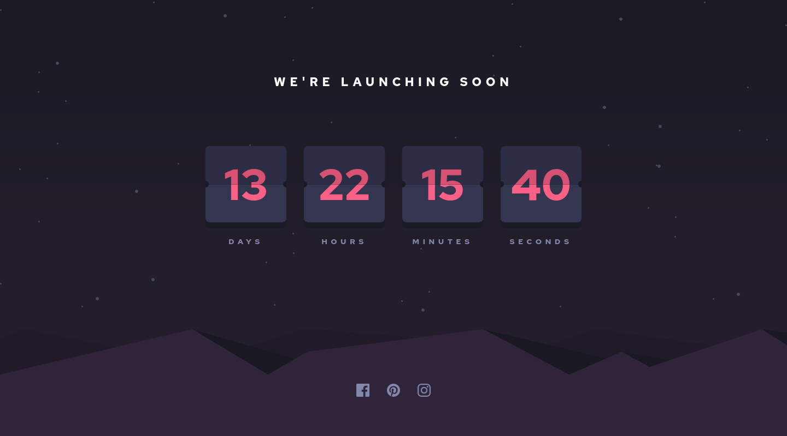

<h1 align="center">Frontend Mentor - Launch countdown timer solution</h1>

  <h3>
    <a href="https://dev-mv6.github.io/Frontend-Mentor-Challenges/Launch%20countdown%20timer/">
      Live
    </a>
     | 
    <a href="https://www.frontendmentor.io/challenges/launch-countdown-timer-N0XkGfyz-">
      Challenge
    </a>
    | 
    <a href="https://www.frontendmentor.io/solutions/launch-countdown-timer-5T0bFmuXRy">
      Solution
    </a>
  </h3>

## Table of contents

- [Overview](#overview)
  - [The challenge](#the-challenge)
  - [Links](#links)
- [Development](#development)
  - [Built with](#built-with)
  - [Notes](#notes)
- [Author](#author)

## Overview

This is a solution to the [Launch countdown timer challenge on Frontend Mentor](https://www.frontendmentor.io/challenges/launch-countdown-timer-N0XkGfyz-).

### The challenge

Users should be able to:

- See hover states for all interactive elements on the page
- See a live countdown timer that ticks down every second (start the count at 14 days)
- **Bonus**: When a number changes, make the card flip from the middle

### Links

- Solution URL: [Frontend Mentor Solution](https://www.frontendmentor.io/solutions/launch-countdown-timer-5T0bFmuXRy)
- Live Site URL: [GitHub Pages](https://dev-mv6.github.io/Frontend-Mentor-Challenges/Launch%20countdown%20timer/)

## Development

### Built with

### Notes

I changed the original design to make it more responsive for small screens.

**Mobile design (Original)**

**Mobile design (New)**

## Author

- GitHub - [@Dev-MV6](https://github.com/Dev-MV6)
- Frontend Mentor - [@Dev-MV6](https://www.frontendmentor.io/profile/Dev-MV6)
