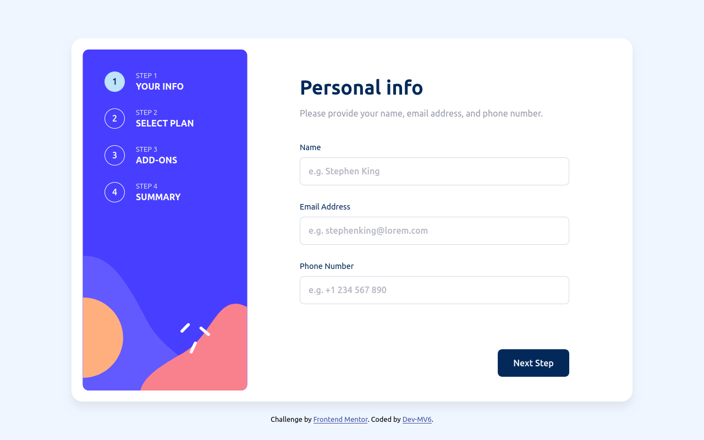

<h1 align="center">Frontend Mentor - Multi-step form solution</h1>

<div align="center">
  <h3>
    <a href="https://dev-mv6.github.io/Frontend-Mentor-Challenges/Multi-step%20form/">
      Live
    </a>
    <span> | </span>
    <a href="https://www.frontendmentor.io/challenges/multistep-form-YVAnSdqQBJ">
      Challenge
    </a>
   <span> | </span>
    <a href="https://www.frontendmentor.io/solutions/responsive-multistep-form-with-vanilla-js-ooKQ3c-_x4">
      Solution
    </a>
  </h3>
</div>

## Table of contents

- [Overview](#overview)
  - [The challenge](#the-challenge)
  - [Screenshot](#screenshot)
  - [Links](#links)
- [Development](#development)
  - [Built with](#built-with)
  - [Notes](#notes)
  - [Useful resources](#useful-resources)
- [Author](#author)

## Overview

This is a solution to the [Multi-step form challenge on Frontend Mentor](https://www.frontendmentor.io/challenges/multistep-form-YVAnSdqQBJ).

### The challenge

Users should be able to:

- Complete each step of the sequence
- Go back to a previous step to update their selections
- See a summary of their selections on the final step and confirm their order
- View the optimal layout for the interface depending on their device's screen size
- See hover and focus states for all interactive elements on the page
- Receive form validation messages if:
  - A field has been missed
  - The email address is not formatted correctly
  - A step is submitted, but no selection has been made

### Screenshot


### Links

- Solution URL: [Frontend Mentor Solution](https://www.frontendmentor.io/solutions/responsive-multistep-form-with-vanilla-js-ooKQ3c-_x4)
- Live Site URL: [GitHub Pages](https://dev-mv6.github.io/Frontend-Mentor-Challenges/Multi-step%20form/)

## Development

### Built with


### Notes

In this challenge I used **CSS** code instead of **JavaScript** code in certain parts to add the functionality of some components, such as the toggle switch for selecting the plan billing cycle (monthly/yearly).

```html
<div id="step_screen__content_2__plan_billing_control">
  <input id="billing_toggle_switch" style="display: none;" type="checkbox" />
  <label class="toggle_switch" for="billing_toggle_switch"></label>
  <span id="billing_option-monthly" class="toggle_switch-option" tabindex="0">Monthly</span>
  <span id="billing_option-yearly" class="toggle_switch-option" tabindex="0">Yearly</span>
</div>
```

This is achieved by using CSS pseudo-classes to check the state of a hidden **input** (checkbox) linked to a **label** styled with pseudo-elements to make it look like a toggle switch.

```css
/* Basic switch style */
.toggle_switch {
  margin-left: 20px;
  margin-right: 20px;
  border-radius: 20px;
  height: 20px;
  width: 40px;
  background-color: var(--marine-blue);
  position: relative;
}

.toggle_switch::after {
  content: '';
  background-color: #fff;
  border-radius: 100%;
  width: 12px;
  height: 12px;
  left: 4px;
  top: 4px;
  position: absolute;
  transition: left 300ms cubic-bezier(0.68, -0.55, 0.265, 1.55);
}

/* Change the switch state */
#billing_toggle_switch:checked + .toggle_switch::after {
  left: 24px;
  top: 4px;
}

#billing_toggle_switch:checked ~ #billing_option-yearly {
  color: var(--marine-blue);
}

#billing_toggle_switch:not(:checked) ~ #billing_option-monthly {
  color: var(--marine-blue);
}
```

When the label gets clicked the hidden **checkbox** changes its state and then CSS automatically updates the styles for the toggle switch.


This kind of practice can be useful when trying to optimize a big website. Using **JavaScript** for a bunch of things like this may have a slight impact on the performance of the site. On the other hand, it can also help to simplify and keep the code consistent and cleaner, leaving **JavaScript** for the things that actually require it (like getting the state of the switch).

### Useful resources

- [MDN Web Docs: CSS selectors](https://developer.mozilla.org/en-US/docs/Web/CSS/CSS_Selectors)

## Author

- GitHub - [@Dev-MV6](https://github.com/Dev-MV6)
- Frontend Mentor - [@Dev-MV6](https://www.frontendmentor.io/profile/Dev-MV6)
