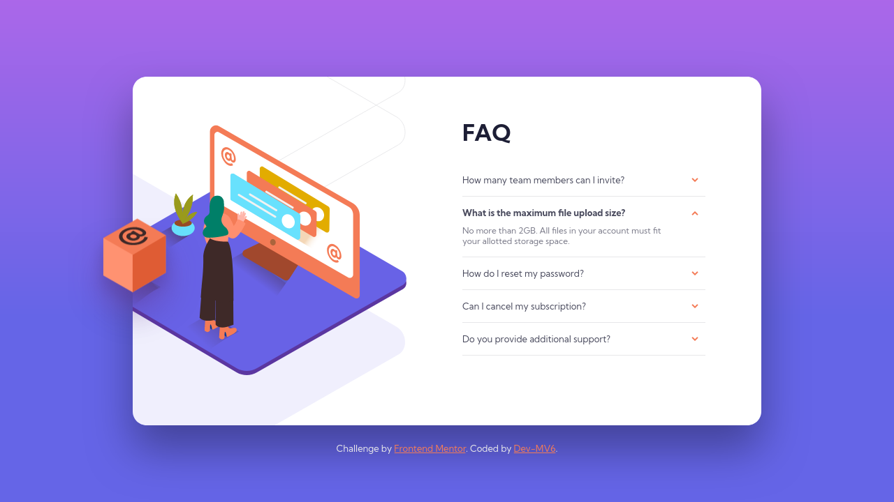
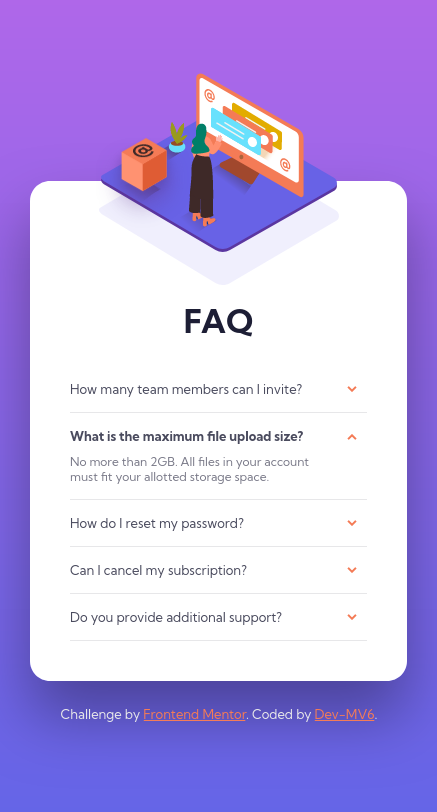

<h1 align="center">Frontend Mentor - FAQ accordion card solution</h1>

  <h3>
    <a href="https://dev-mv6.github.io/Frontend-Mentor-Challenges/N-Challenges/FAQ%20accordion%20card/">
      Live
    </a>
     | 
    <a href="https://www.frontendmentor.io/challenges/faq-accordion-card-XlyjD0Oam">
      Challenge
    </a>
    | 
    <a href="https://www.frontendmentor.io/solutions/responsive-faq-accordion-card-_APfL2xhSy">
      Solution
    </a>
  </h3>

## Table of contents

- [Overview](#overview)
  - [The challenge](#the-challenge)
  - [Screenshots](#screenshots)
  - [Links](#links)
- [Development](#development)
  - [Built with](#built-with)
  - [Useful resources](#useful-resources)
- [Author](#author)

## Overview

This is a solution to the [FAQ accordion card challenge on Frontend Mentor](https://www.frontendmentor.io/challenges/faq-accordion-card-XlyjD0Oam).

### The challenge

Users should be able to:

- View the optimal layout for the component depending on their device's screen size
- See hover states for all interactive elements on the page
- Hide/Show the answer to a question when the question is clicked

### Screenshots

**Mobile Design**

### Links

- Solution URL: [Frontend Mentor Solution](https://www.frontendmentor.io/solutions/responsive-faq-accordion-card-_APfL2xhSy)
- Live Site URL: [GitHub Pages](https://dev-mv6.github.io/Frontend-Mentor-Challenges/N-Challenges/FAQ%20accordion%20card/)

## Development

### Built with

### Useful resources

- [Codepen by Manuel Pinto: Pure CSS Gradient Background Animation](https://codepen.io/P1N2O/pen/pyBNzX)

## Author

- GitHub - [@Dev-MV6](https://github.com/Dev-MV6)
- Frontend Mentor - [@Dev-MV6](https://www.frontendmentor.io/profile/Dev-MV6)
