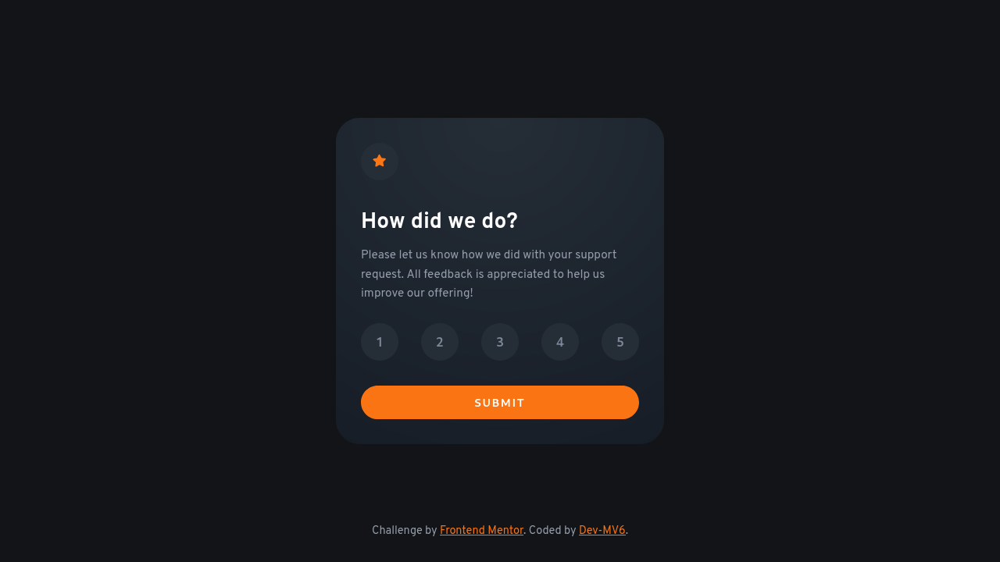

<h1 align="center">Frontend Mentor - Interactive rating component solution</h1>

  <h3>
    <a href="https://dev-mv6.github.io/Frontend-Mentor-Challenges/N-Challenges/Interactive%20rating%20component/">
      Live
    </a>
     | 
    <a href="https://www.frontendmentor.io/challenges/interactive-rating-component-koxpeBUmI">
      Challenge
    </a>
    | 
    <a href="https://www.frontendmentor.io/solutions/interactive-rating-component-vu6hgjuJLj">
      Solution
    </a>
  </h3>

## Overview

This is a solution to the [Interactive rating component challenge on Frontend Mentor](https://www.frontendmentor.io/challenges/interactive-rating-component-koxpeBUmI).

### The challenge

Users should be able to:

- View the optimal layout for the app depending on their device's screen size
- See hover states for all interactive elements on the page
- Select and submit a number rating
- See the "Thank you" card state after submitting a rating

### Links

- Solution URL: [Frontend Mentor Solution](https://www.frontendmentor.io/solutions/interactive-rating-component-vu6hgjuJLj)
- Live Site URL: [GitHub Pages](https://dev-mv6.github.io/Frontend-Mentor-Challenges/N-Challenges/Interactive%20rating%20component/)

## Development

### Built with

## Author

- GitHub - [@Dev-MV6](https://github.com/Dev-MV6)
- Frontend Mentor - [@Dev-MV6](https://www.frontendmentor.io/profile/Dev-MV6)
