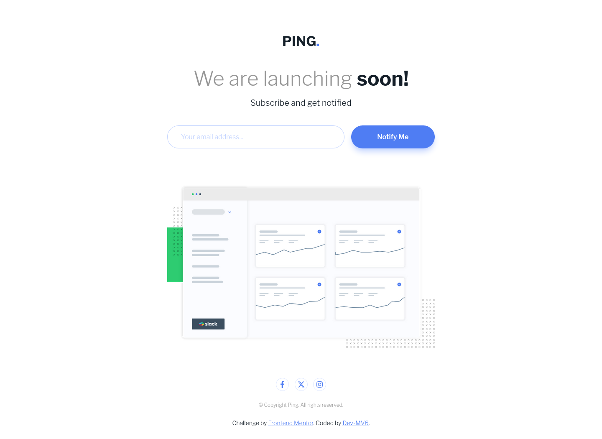

<h1 align="center">Frontend Mentor - Ping coming soon page solution</h1>

  <h3>
    <a href="https://dev-mv6.github.io/Frontend-Mentor-Challenges/N-Challenges/Ping%20coming%20soon%20page/">
      Live
    </a>
     | 
    <a href="https://www.frontendmentor.io/challenges/ping-single-column-coming-soon-page-5cadd051fec04111f7b848da">
      Challenge
    </a>
    | 
    <a href="https://www.frontendmentor.io/solutions/ping-single-column-coming-soon-page-YE_uKmSCnA">
      Solution
    </a>
  </h3>

## Overview

This is a solution to the [Ping coming soon page challenge on Frontend Mentor](https://www.frontendmentor.io/challenges/ping-single-column-coming-soon-page-5cadd051fec04111f7b848da).

### Links

- Solution URL: [Frontend Mentor Solution](https://www.frontendmentor.io/solutions/ping-single-column-coming-soon-page-YE_uKmSCnA)
- Live Site URL: [GitHub Pages](https://dev-mv6.github.io/Frontend-Mentor-Challenges/N-Challenges/Ping%20coming%20soon%20page/)

## Development

### Built with

## Author

- GitHub - [@Dev-MV6](https://github.com/Dev-MV6)
- Frontend Mentor - [@Dev-MV6](https://www.frontendmentor.io/profile/Dev-MV6)
