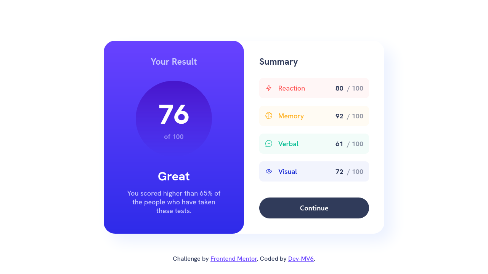

<h1 align="center">Frontend Mentor - Results summary component solution</h1>

  <h3>
    <a href="https://dev-mv6.github.io/Frontend-Mentor-Challenges/N-Challenges/Results%20summary%20component/">
      Live
    </a>
     | 
    <a href="https://www.frontendmentor.io/challenges/results-summary-component-CE_K6s0maV">
      Challenge
    </a>
    | 
    <a href="https://www.frontendmentor.io/solutions/results-summary-component-JydNxUsBIY">
      Solution
    </a>
  </h3>

## Overview

This is a solution to the [Results summary component challenge on Frontend Mentor](https://www.frontendmentor.io/challenges/results-summary-component-CE_K6s0maV).

### Links

- Solution URL: [Frontend Mentor Solution](https://www.frontendmentor.io/solutions/results-summary-component-JydNxUsBIY)
- Live Site URL: [GitHub Pages](https://dev-mv6.github.io/Frontend-Mentor-Challenges/N-Challenges/Results%20summary%20component/)

## Development

### Built with

## Author

- GitHub - [@Dev-MV6](https://github.com/Dev-MV6)
- Frontend Mentor - [@Dev-MV6](https://www.frontendmentor.io/profile/Dev-MV6)
