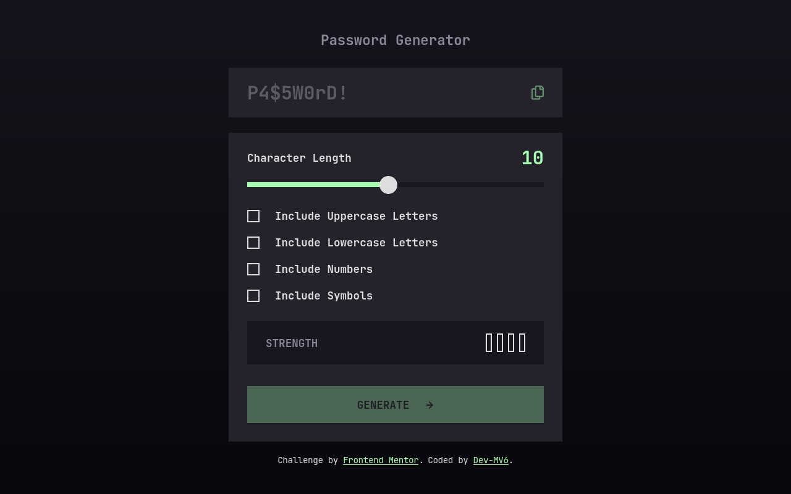
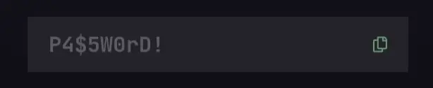

<h1 align="center">Frontend Mentor - Password generator app solution</h1>

  <h3>
    <a href="https://dev-mv6.github.io/Frontend-Mentor-Challenges/Password%20generator%20app">
      Live
    </a>
     | 
    <a href="https://www.frontendmentor.io/challenges/password-generator-app-Mr8CLycqjh">
      Challenge
    </a>
   <!--  | 
    <a href="">
      Solution
    </a> -->
  </h3>

## Table of contents

- [Overview](#overview)
  - [The challenge](#the-challenge)
  - [Screenshot](#screenshot)
  - [Links](#links)
- [Development](#development)
  - [Built with](#built-with)
  - [Notes](#notes)
  - [Useful resources](#useful-resources)
- [Author](#author)

## Overview

This is a solution to the [Password generator app challenge on Frontend Mentor](https://www.frontendmentor.io/challenges/password-generator-app-Mr8CLycqjh).

### The challenge

Users should be able to:

- Generate a password based on the selected inclusion options
- Copy the generated password to the computer's clipboard
- See a strength rating for their generated password
- View the optimal layout for the interface depending on their device's screen size
- See hover and focus states for all interactive elements on the page

### Screenshot

### Links

<!-- - Solution URL: [Frontend Mentor Solution]() -->
- Live Site URL: [GitHub Pages](https://dev-mv6.github.io/Frontend-Mentor-Challenges/Password%20generator%20app)

## Development

### Built with

### Notes

**Password Generation Effect 🔥**

I adapted [Justin Windle's code](https://codepen.io/soulwire/pen/mEMPrK) to animate the characters with this "scramble" effect every time a new password is generated.

### Useful resources

- [Codepen by Justin Windle: Text Scramble Effect](https://codepen.io/soulwire/pen/mEMPrK)

## Author

- GitHub - [@Dev-MV6](https://github.com/Dev-MV6)
- Frontend Mentor - [@Dev-MV6](https://www.frontendmentor.io/profile/Dev-MV6)
