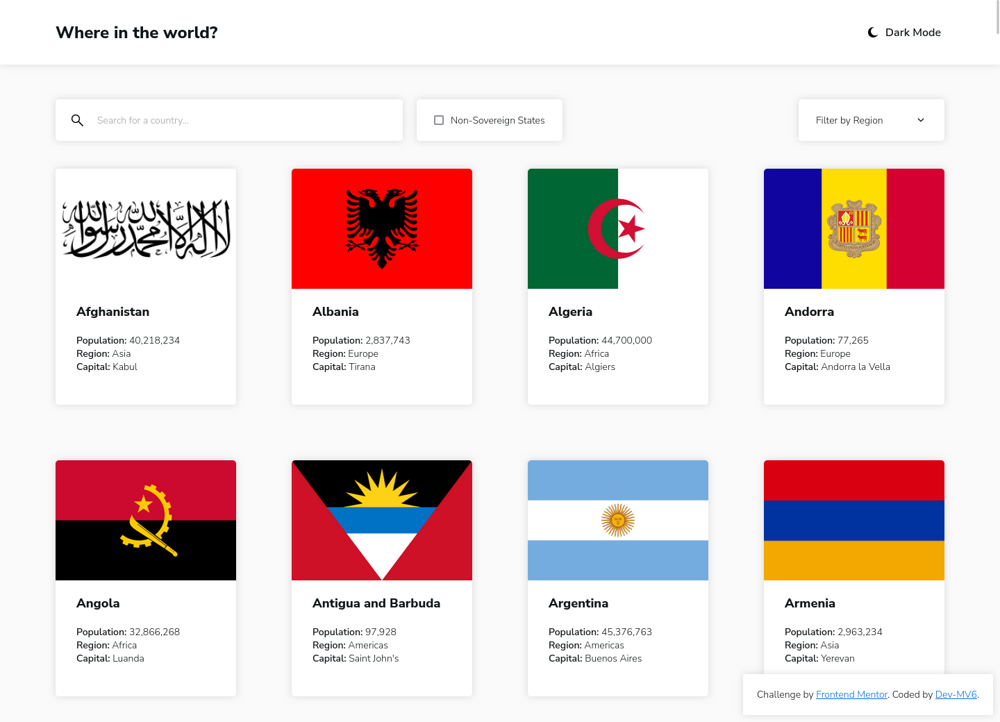
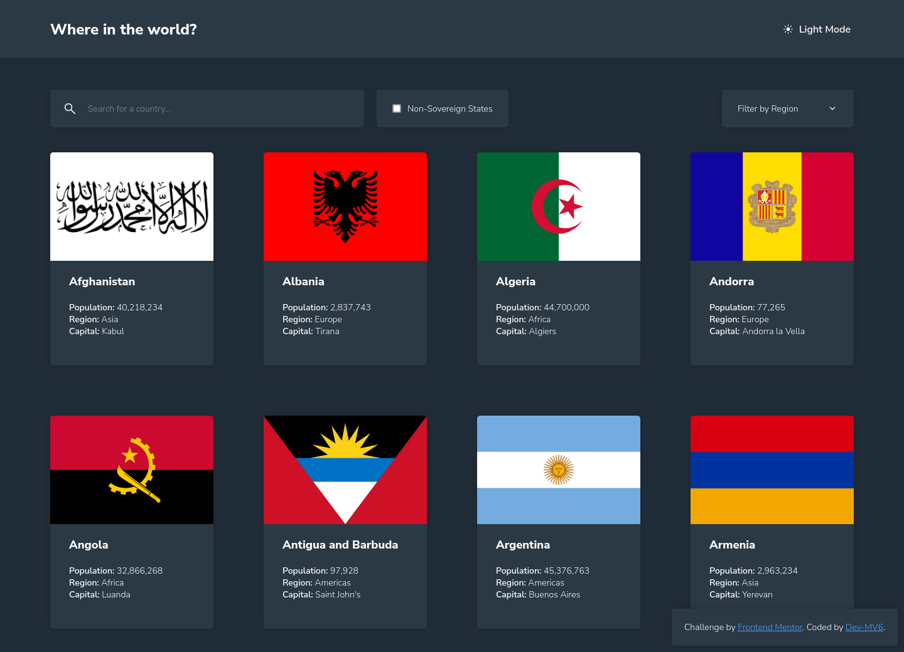
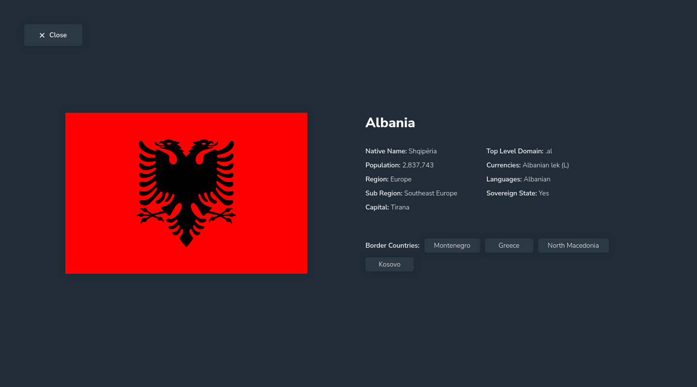

<h1 align="center">Frontend Mentor - REST Countries API with color theme switcher solution</h1>

  <h3>
    <a href="https://dev-mv6.github.io/Frontend-Mentor-Challenges/REST%20Countries%20API/">
      Live
    </a>
     | 
    <a href="https://www.frontendmentor.io/challenges/rest-countries-api-with-color-theme-switcher-5cacc469fec04111f7b848ca">
      Challenge
    </a>
    | 
    <a href="https://www.frontendmentor.io/solutions/rest-countries-api-with-color-theme-switcher-S0kC8ysb9w">
      Solution
    </a>
  </h3>

## Table of contents

- [Overview](#overview)
  - [The challenge](#the-challenge)
  - [Screenshots](#screenshots)
  - [Links](#links)
- [Development](#development)
  - [Built with](#built-with)
  - [Notes](#notes)
  - [Useful resources](#useful-resources)
- [Author](#author)

## Overview

This is a solution to the [REST Countries API with color theme switcher challenge on Frontend Mentor](https://www.frontendmentor.io/challenges/rest-countries-api-with-color-theme-switcher-5cacc469fec04111f7b848ca).

### The challenge

Users should be able to:

- See all countries from the API on the homepage
- Search for a country using an `input` field
- Filter countries by region
- Click on a country to see more detailed information on a separate page
- Click through to the border countries on the detail page
- Toggle the color scheme between light and dark mode _(optional)_

### Screenshots

**Home Page**

**Country Card Details**

### Links

- Solution URL: [Frontend Mentor Solution](https://www.frontendmentor.io/solutions/rest-countries-api-with-color-theme-switcher-S0kC8ysb9w)
- Live Site URL: [GitHub Pages](https://dev-mv6.github.io/Frontend-Mentor-Challenges/REST%20Countries%20API/)

## Development

### Built with

 

- HTML5
- CSS
- Flexbox
- CSS Grid
- Javascript
- [REST Countries API](https://restcountries.com/)

### Notes

For this challenge, I decided to deviate slightly from the original design because I wanted it to align with my concept of treating each country as a 'card': When the user selects a card, it flips over to reveal detailed information about the country on the back face. Once the user presses the button to close the country information, the card flips again, returning to its initial position in the grid.

I've also added a checkbox to choose whether to include non-sovereign states in the results or not.

In the future, I'm planning to implement a preview of the region map to include in the detailed information of each country. As far as I know, the 'GeoChart' from the Google Charts API may be useful for this purpose.

### Useful resources

- [Safari/Webkit 3D intersection bug workaround](https://stackoverflow.com/a/18167565)

## Author

- GitHub - [@Dev-MV6](https://github.com/Dev-MV6)
- Frontend Mentor - [@Dev-MV6](https://www.frontendmentor.io/profile/Dev-MV6)
