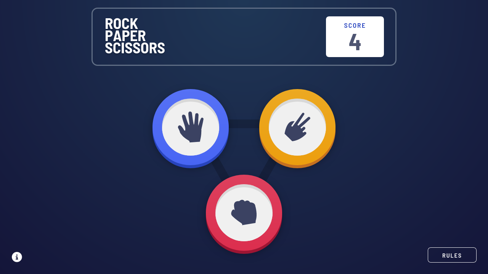
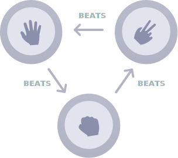
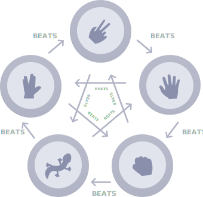
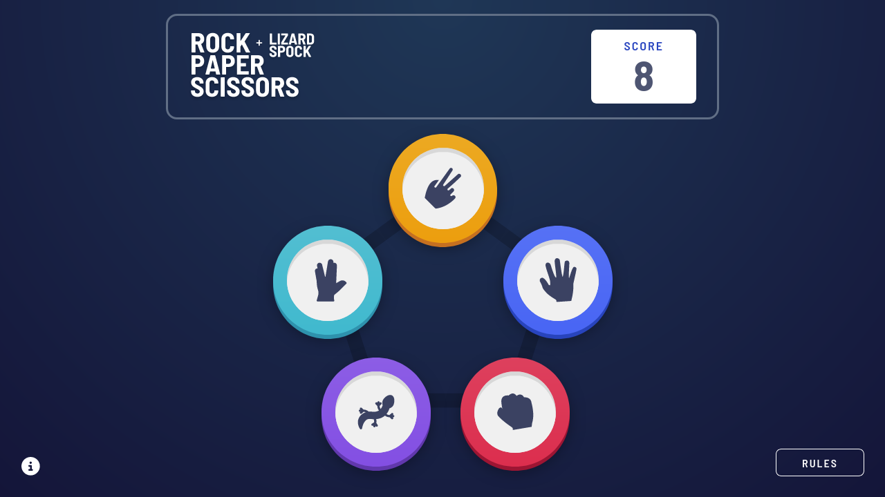

<h1 align="center">Frontend Mentor - Rock, Paper Scissors solution</h1>

  <h3>
    <a href="https://dev-mv6.github.io/Frontend-Mentor-Challenges/Rock,Paper,Scissors%20game/">
      Live
    </a>
     | 
    <a href="https://www.frontendmentor.io/challenges/rock-paper-scissors-game-pTgwgvgH">
      Challenge
    </a>
    | 
    <a href="https://www.frontendmentor.io/solutions/rock-paper-scissors-game-with-react-9DHiNdKQoE">
      Solution
    </a>
  </h3>

## Table of contents

- [Overview](#overview)
  - [The challenge](#the-challenge)
  - [Screenshots](#screenshots)
  - [Links](#links)
- [Development](#development)
  - [Built with](#built-with)
  - [Notes](#notes)
  - [Useful resources](#useful-resources)
- [Author](#author)

## Overview

This is a solution to the [Rock, Paper Scissors challenge on Frontend Mentor](https://www.frontendmentor.io/challenges/rock-paper-scissors-game-pTgwgvgH).

### The challenge

Users should be able to:

- View the optimal layout for the game depending on their device's screen size
- Play Rock, Paper, Scissors against the computer
- Maintain the state of the score after refreshing the browser _(optional)_
- **Bonus**: Play Rock, Paper, Scissors, Lizard, Spock against the computer _(optional)_

#### **Rules**

If the player wins, they gain 1 point. If the computer wins, the player loses one point.

#### Original Game

#### Bonus Game

Not sure what Rock, Paper, Scissors, Lizard, Spock is? [Check out this clip from The Big Bang Theory](https://www.youtube.com/watch?v=iSHPVCBsnLw).

### Screenshots

**Original Game:**

**Bonus Game:**

### Links

- Solution URL: [Frontend Mentor Solution](https://www.frontendmentor.io/solutions/rock-paper-scissors-game-with-react-9DHiNdKQoE)
- Live Site URL: [GitHub Pages](https://dev-mv6.github.io/Frontend-Mentor-Challenges/Rock,Paper,Scissors%20game/)

## Development

### Built with

### Notes

Each game mode has its own score counter, the user can change the game mode by clicking on the game bar logo or **reset** the score by clicking on the score counter.

### Useful resources

- [Modals with HTML \<dialog\> element in JavaScript and React - Dimterion](https://medium.com/@dimterion/modals-with-html-dialog-element-in-javascript-and-react-fb23c885d62e)
- [Animating Layouts with the FLIP Technique - David Khourshid](https://css-tricks.com/animating-layouts-with-the-flip-technique/)

## Author

- GitHub - [@Dev-MV6](https://github.com/Dev-MV6)
- Frontend Mentor - [@Dev-MV6](https://www.frontendmentor.io/profile/Dev-MV6)
