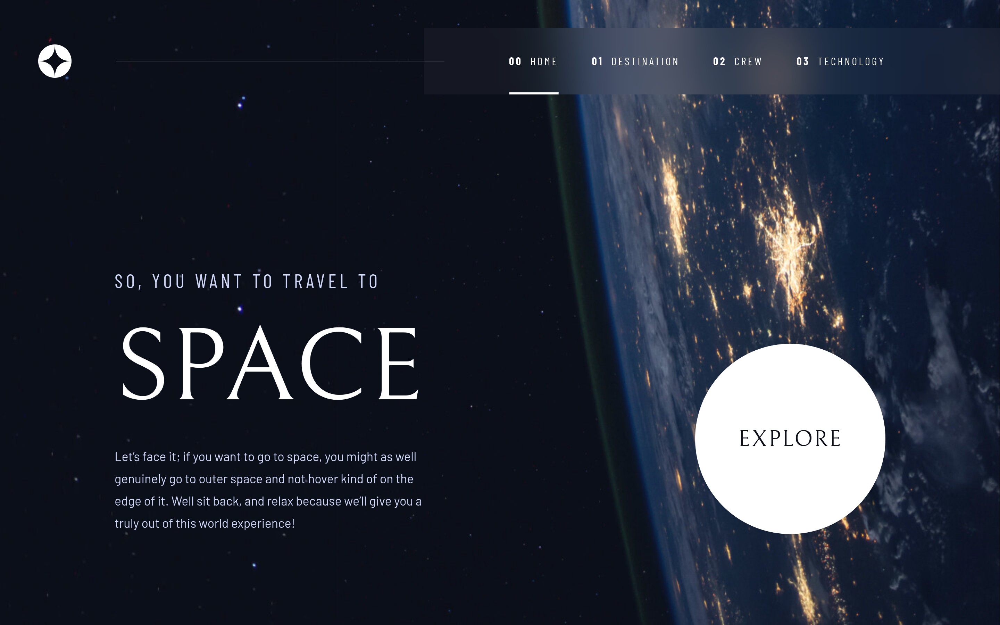
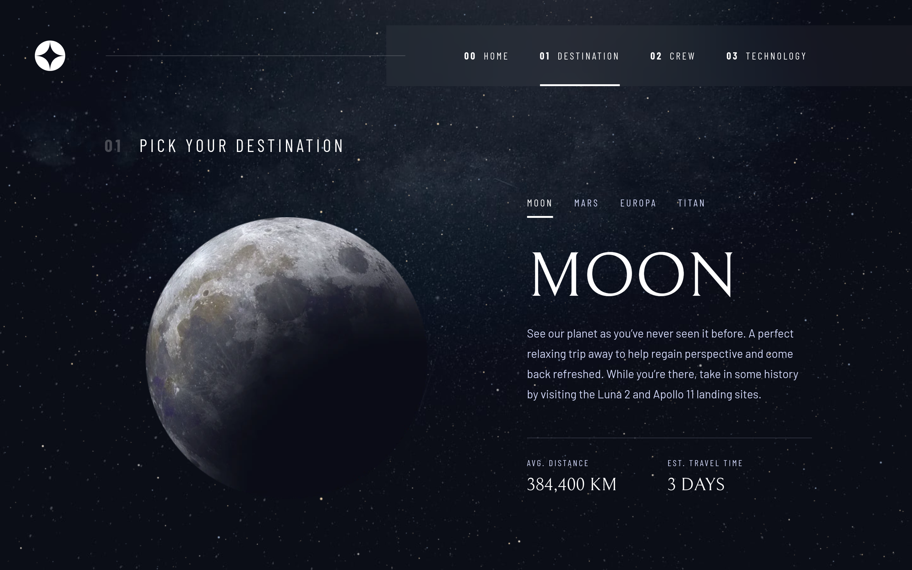

<h1 align="center">Frontend Mentor - Space tourism website solution</h1>

  <h3>
    <a href="https://space-tourism-8ed1e2.netlify.app">
      Live
    </a>
     | 
    <a href="https://www.frontendmentor.io/challenges/space-tourism-multipage-website-gRWj1URZ3">
      Challenge
    </a>
    | 
    <a href="https://www.frontendmentor.io/solutions/space-tourism-multipage-website-CCobW-ZW5o">
      Solution
    </a>
  </h3>

## Table of contents

- [Overview](#overview)
  - [The challenge](#the-challenge)
  - [Screenshot](#screenshot)
  - [Links](#links)
- [Development](#development)
  - [Built with](#built-with)
  - [Notes](#notes)
- [Author](#author)

## Overview

This is a solution to the [Space tourism website challenge on Frontend Mentor](https://www.frontendmentor.io/challenges/space-tourism-multipage-website-gRWj1URZ3).

### The challenge

Users should be able to:

- View the optimal layout for each of the website's pages depending on their device's screen size
- See hover states for all interactive elements on the page
- View each page and be able to toggle between the tabs to see new information

### Screenshot

### Links

- Solution URL: [Frontend Mentor Solution](https://www.frontendmentor.io/solutions/space-tourism-multipage-website-CCobW-ZW5o)
- Live Site URL: [Netlify](https://space-tourism-8ed1e2.netlify.app)

## Development

### Built with

### Notes

**Animations**

For the most basic transitions in the pages, I used the [Anime.js](https://animejs.com/) library. For transitions between the routes, I used the `SwitchTransition`and `Transition` components from the [React Transition Group](https://reactcommunity.org/react-transition-group/) library. The animated backgrounds for the Destination and Technology pages were made using Canvas API.

## Author

- GitHub - [@Dev-MV6](https://github.com/Dev-MV6)
- Frontend Mentor - [@Dev-MV6](https://www.frontendmentor.io/profile/Dev-MV6)
