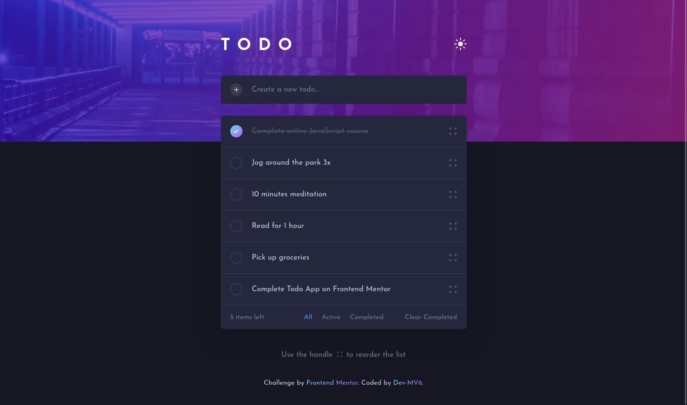
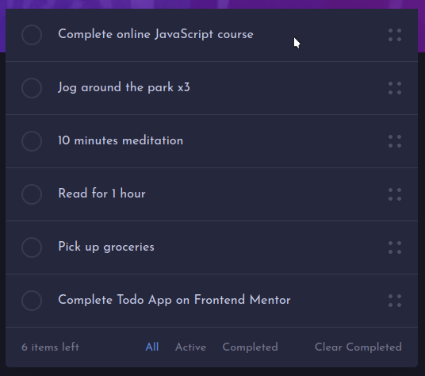

<h1 align="center">Frontend Mentor - Todo app solution</h1>

<div align="center">
  <h3>
    <a href="https://dev-mv6.github.io/Frontend-Mentor-Challenges/Todo%20app/">
      Live
    </a>
    <span> | </span>
    <a href="https://www.frontendmentor.io/challenges/todo-app-Su1_KokOW">
      Challenge
    </a>
   <span> | </span>
    <a href="https://www.frontendmentor.io/solutions/responsive-todo-app-with-vanilla-js-ZogZAIIVIM">
      Solution
    </a>
  </h3>
</div>

## Table of contents

- [Overview](#overview)
  - [The challenge](#the-challenge)
  - [Screenshot](#screenshot)
  - [Links](#links)
- [Development](#development)
  - [Built with](#built-with)
  - [Notes](#notes)
  - [Useful resources](#useful-resources)
- [Author](#author)

## Overview

This is a solution to the [Todo app challenge on Frontend Mentor](https://www.frontendmentor.io/challenges/todo-app-Su1_KokOW).

### The challenge

Users should be able to:

- View the optimal layout for the app depending on their device's screen size
- See hover states for all interactive elements on the page
- Add new "todos" to the list
- Mark "todos" as complete
- Delete "todos" from the list
- Filter by all/active/complete "todos"
- Clear all completed "todos"
- Toggle light and dark mode
- **Bonus**: Reorder the items on the list

### Screenshot


### Links

- Solution URL: [Frontend Mentor Solution](https://www.frontendmentor.io/solutions/responsive-todo-app-with-vanilla-js-ZogZAIIVIM)
- Live Site URL: [GitHub Pages](https://dev-mv6.github.io/Frontend-Mentor-Challenges/Todo%20app/)

## Development

### Built with


<br>

- HTML5
- CSS
- Flexbox
- Javascript
- Slip.js (Library for reordering)

### Notes

**Filtering the item list**

To efficiently enable filtering of the items in the container, I used radio inputs as triggers for the filters, separating the radios of the desktop design from the radios of the mobile design.

```html
<!-- Desktop filter list -->
<div class="filter-list filter-list--desk">
  <input id="filter-radio_all--desk" class="filter-radio" type="radio" name="filter" value="all" autocomplete="off" checked />
  <label class="filter-label" for="filter-radio_all--desk">All</label>

  <input id="filter-radio_active--desk" class="filter-radio" type="radio" name="filter" value="active" autocomplete="off" />
  <label class="filter-label" for="filter-radio_active--desk">Active</label>

  <input id="filter-radio_completed--desk" class="filter-radio" type="radio" name="filter" value="completed" autocomplete="off" />
  <label class="filter-label" for="filter-radio_completed--desk">Completed</label>
</div>

<!-- Mobile filter list -->
<!-- (Same as the desktop list but radios have different IDs to separate them from the ones of the desktop design, since they belong to different radio groups) -->
```

Javascript updates the class name of the container based on the selected radio input.

```javascript
const filterRadioElements = document.querySelectorAll('.filter-radio') // Get all filter radio inputs
filterRadioElements.forEach((radioElement) => {
  radioElement.addEventListener('click', (e) => {
    const selectedFilterValue = e.target.value
    document.querySelector('.todos-view').className =
      selectedFilterValue === 'all' ? 'todos-view' : `todos-view todos-view--filtered todos-view--filtered_${selectedFilterValue}`
  })
})
```

And CSS takes care of filtering the item list using the class name assigned to the container.

```css
/* Filter: Active items (hide completed items) */
.todos-view--filtered_active .todo-list__item--completed {
  display: none !important;
}

/* Filter: Completed items (hide active items) */
.todos-view--filtered_completed .todo-list__item:not(.todo-list__item--completed) {
  display: none !important;
}
```

**Reordering the item list**

Reordering was possible thanks to the implementation of the [Slip.js](https://github.com/kornelski/slip) library. This library makes really easy to add reordering and swiping capabilities to the items of a list. However, for this challenge, I disabled the swiping feature, leaving only the reordering functionality.



**UI alerts**

Additionally to the functionalities required by the challenge, I created an `alert()` method to show a simple alert in the app UI when the user performs specific actions like changing the color theme or filtering the item list.


### Useful resources

- [Slip.js Library](https://github.com/kornelski/slip)

## Author

- GitHub - [@Dev-MV6](https://github.com/Dev-MV6)
- Frontend Mentor - [@Dev-MV6](https://www.frontendmentor.io/profile/Dev-MV6)
